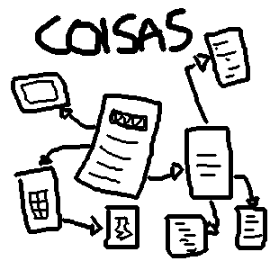

coisas
========

A pure-javascript CMS for multipurpose websites in GitHub Pages.

## What is this?

Maybe a Jekyll that runs in your browser and fetches data, lets you edit it and then deploys everything to GitHub through HTTP.

## How to start:

Go to http://github.com/fiatjaf/coisas-template. Fork it, change its name from `coisas-template` to something else (GitHub will need this, or some other kind of change, to render the repo as a webpage) and go to the corresponding `edit.html` url (something like `http://yourname.github.io/newreponame/edit.html`).

If you wanna use your root GitHub name, rename the repo to `yourname.github.io` (in place of `coisas-template`) and set the `master` branch to be the primary.

Remember to change the `baseURL` at the root document before deploying for the first time.

## Examples:

  * http://fiatjaf.github.io/ and http://fiatjaf.github.io/edit.html
  * http://pollyannas.github.io/ and http://pollyannas.github.io/edit.html
  * http://geraldoquagliato.github.io/site and http://geraldoquagliato.github.io/site/edit.html

## The internals:

There is a directory, at some GitHub Pages repo, structured as this:

```
README.md
articles/
  README.md
  about-that-day/
    README.md
  about-that-thing/
    README.md
blog/
  README.md
  just-arrived-at-viena/
    README.md
  visiting-mises-old-house/
    README.md
```

Each README.md must be a markdown file with a YAML front-matter describing its metadata. You can put anything there, but, for now, the metadata that gets used by `coisas` is:

```
---
title: The title of the page and that will be showed in the list of children for this doc's parent.
date: An optional string that will be displayed at the parent's children list along with the title.
sort: The name of the attribute that will be used to sort the children of this page. "date", for example. ("-date" would make for a descending sort, like a blog would do, newer posts first)
---

# page title

page text.
```

For normal files. The special case is the root `/README.md` file, that must have a `baseURL` (without the ending slash) of the site and a `name` for the name of the site, showed at the top of all pages and in the HTML `<title>`.

______

Ok, You have this. This makes a pretty readable website right at its GitHub repository page at `https://github.com/yourname/yourrepo`, but no, we don't want that.

`coisas` will read everything and make you a lot of `index.html`, placed along each `README.md`, with a default HTML structure for every page. This includes a breadcrumb showing the path of the present page, the written content of each page, and a list of children of the page.

You can edit any page through the editing interface, at `/edit.html`, and save. It will fetch the children of the edited page, render it and put it live. It will only update itself, no mass rerender of everything.

You can style the pages using CSS (in your computer or using the GitHub's editing interface), or you can change the HTML template and rerender the entire site.

Rerenders are cool, they can can take a lot of data, a lot of new `README.md` added through other means (such as a `git push`), but, as each `README.md` will need to be fetched serially, then posted as a blob to GitHub, then each subtree, one by one, serially, posted to GitHub, it can take a lot of timeif you have a lot of documents. I would estimate 1 minute for each 20 documents.

______

I'm using pages and documents interchangeably. Every page is a document. There is no concept of "blog post", "article" or "list of blog posts". Every page can have content or not, every page cna have a date or not, and can be sortered by date or not. Every page can have children or not. So if you want a blog, just have a root page and a lot of pages as direct sons of that root page. Or (as I would recommend), have a "blog" page and let it be the parent of a lot of pages, your blog posts.

______

In the previous explanation, it seems that you need a directory with documents to start using `coisas`. This is false. You don't need it. You just need to go to you `edit.html` and start writing right there.

I hope it is all well understood.
